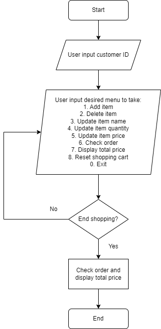

# Simple Cashier Program
This project demonstrates a simple program with several basic operations that are necessary to register items at the cashier. The program is built mainly as function and object based program using Python (OOP). More details about this program will be further discussed in this documentation.

---

## Background
A program is needed for a cash register at a self-service supermarket. Using this program, users are able to input their membership ID, add, delete, and modify the name, quantity, and price of items they want to buy. The program can also show a list of items in their shopping cart, and calculate the discounts that the customers can get based on their total spending.

## Requirements
- Customers can input their ID.
- Customers can input the item name, quantity, and price.
- Customers can modify the item name, quantity, and price.
- Customers can delete item name, quantity, and price.
- Customers can reset items their shopping cart.
- Customers can check their orders.
- The program can calculate the total price, including discounts.

## Flowchart

The program first prompts the user to input their customer or membership ID. After that, it expects users to choose menu or operations to take by inputting a number that corresponds to the menu itself:
> 1. Add item
> 2. Delete item
> 3. Update item name
> 4. Update item quantity
> 5. Update item price
> 6. Check order
> 7. Display total price
> 8. Reset shopping cart
> 0. Exit

After an operation is done, the program will ask whether the user wants to end shopping or the continue with other operation. If the user wants to continue with other operations, the program will again ask which menu or operation to take. If the user wants to end shopping, it quits the loop and display order details and price to pay.

## Attributes, Methods, and Functions
This project consists of three files: `main.py`, `cashregister.py`, and `operations.py`. Attributes, methods, and functions in each file are going to be discussed in this section.

### cashregister.py
This file stores an attribute and all methods for transaction in a class called `Transaction()`. The library `pandas` is needed because it is required by one of the methods under this object. The attribute and methods are as follows:
- **Attribute**
    - `cart`: this attribute is a dictionary that later will be filled with item name as its keys and item quantity, price, and total price as its values.

- **Methods**
    - `add_item(item_name, item_qty, item_price)`: this method is used to add an item (name, quantity, and price) to the `cart`. If the item already exists in the cart, it will add the item quantity and ignore the newly inputted price.
    - `delete_item(item_name)`: this method is used to delete an item in `cart`. The input needed for this method is item name.
    - `update_item_name(item_name, new_item_name)`: this method is used to update item name in `cart`. The input needed for this method is item name to be updated and new item name.
    - `update_item_qty(item_name, new_qty)`: this method is used to update item quantity in `cart`. The input needed for this method is item name and new quantity of the said item.
    - `update_item_price(item_name, new_item_price)`: this method is used to update item price in `cart`. The input needed for this method is item name and new item price of the said item.
    - `check_order()`: this method is used to display all items in `cart`. No input is needed.
    - `total_price()`: this method is used to calculate and display the total price of all items in `cart` including its discounts and finally how much the customer should pay.
    - `reset_transaction()`: this method is used to clear all items in `cart`. No input is needed.

### operations.py
This file stores functions that are necessary for several operations in the main program. The motivation to make an operation as function is, of course, :rainbow:**DRY**:rainbow:.
